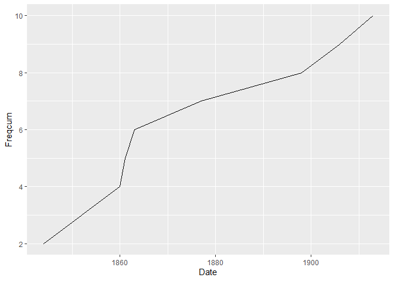

# Exemple de fichier Quarto
Léo Dumont
2025-04-08

- [Présentation analytique du sous-corpus
  choisi](#présentation-analytique-du-sous-corpus-choisi)
- [Présentation des principales caractéristiques textométriques du
  sous-corpus](#présentation-des-principales-caractéristiques-textométriques-du-sous-corpus)
  - [Segmentation lexicale
    (*tokenization*)](#segmentation-lexicale-tokenization)
  - [Taille du sous-corpus](#taille-du-sous-corpus)

Ce document a pour objectif de vous permettre la découverte de
l’environnement de publication [quarto](https://quarto.org/) à travers
l’exemple de quelques éléments de présentation du sous-corpus voyageur.

# Présentation analytique du sous-corpus choisi

Il faudrait d’abord rédiger quelques paragraphes pour présenter le
corpus des ouvrages rédigés par des auteurs ayant le statut de
“voyageur” en s’appuyant sur les idées de l’article de Damon
Mayaffre.(Mayaffre 2002)

Chargement des paquets R nécessaires.

On importe les textes du corpus avec `readtext`.

``` r
textes <- readtext("ss_corpus_voyageurs.csv", text_field = "text", docid_field = "doc_id")
```

On crée le corpus dans `quanteda`.

``` r
corpus_voyageurs <- corpus(textes)
```

On crée le *dataframe* des métadonnées.

``` r
corpus_metadata <- docvars(corpus_voyageurs)
```

Projection de la courbe des ouvrages en fonction de l’année de
publication :

``` r
corpus_metadata |>
  group_by(Date_edition_inf) |>
  summarize(Nombre = n()) |>
  mutate(Freqcum = cumsum(Nombre)) |>
  ggplot(aes(x = Date_edition_inf, y = Freqcum)) +
  geom_line() +
  labs(x = "Date", "Fréquences cumulées")
```

<div id="fig-courbe-publi">




Figure 1: Courbe de la distribution temporelle des ouvrages du
sous-corpus voyageur (fréquences cumulées).

</div>

La courbe de la
<a href="#fig-courbe-publi" class="quarto-xref">Figure 1</a> permet
d’observer une croissance rapide du nombre d’ouvrages publiés jusqu’au
début des années 1860 avant que celle-ci ne ralentisse jusqu’au tournant
du XXe siècle.

# Présentation des principales caractéristiques textométriques du sous-corpus

## Segmentation lexicale (*tokenization*)

Nous allons maintenant procéder à la **segmentation lexicale** du
vocabulaire du sous-corpus avec les fonctions `tokens()` et
`tokens_split()` de *quanteda*. Cette dernière permet d’utiliser les
apostrophes comme un caractère séparateur permettant de découper les
mots du corpus.

``` r
tokens_voyageurs <- tokens(corpus_voyageurs,
                           remove_punct = TRUE,
                           remove_symbols = TRUE,
                           remove_numbers = TRUE)
tokens_voyageurs <- tokens_split(tokens_voyageurs, "'")
tokens_voyageurs <- tokens_split(tokens_voyageurs, "’")
```

## Taille du sous-corpus

Commençons par compter le nombre total de mots (**occurrences**)
présents dans le corpus.

``` r
sum(ntoken(tokens_voyageurs))
```

    [1] 688633

La fonction `ntype()` permet de compter le nombre de **formes** dans
chaque document du corpus.

``` r
ntype(tokens_voyageurs)
```

       15    17    18    24    72   122   133   135   183   184 
     6288 14006 11962 11400  7266 11954  9653  5069 14324  7991 

Mais ici, nous souhaiterions connaître cette information pour la
totalité du corpus. Pour ce faire nous pouvons calculer le
**dictionnaire des fréquences** via la fonction `textstat_frequency()`
du paquet *quanteda.textstats*.

``` r
dfm_voyageur <- dfm(tokens_voyageurs, tolower = FALSE)
dico_freq <- textstat_frequency(dfm_voyageur)
```

Cette fonction renvoie un *dataframe* où chaque ligne est un des mots du
corpus revenant au moins une fois. Il suffit donc de compter le nombre
de lignes du *dataframe* pour obtenir le nombre de formes :

``` r
nrow(dico_freq)
```

    [1] 46706

<div id="refs" class="references csl-bib-body hanging-indent"
entry-spacing="0">

<div id="ref-mayaffre_corpus_2002" class="csl-entry">

Mayaffre, Damon. 2002. « Les corpus réflexifs : entre architextualité et
hypertextualité ». *Corpus*, nᵒ 1 (novembre).
<https://doi.org/10.4000/corpus.11>.

</div>

</div>
