# Rapport de recherche
Geoffroy Zhang
2025-04-08

- [Présentation analytique du sous-corpus
  choisi](#présentation-analytique-du-sous-corpus-choisi)
  - [La dimension heuristique du
    sous-corpus](#la-dimension-heuristique-du-sous-corpus)
  - [Positionnement du sous-corpus par rapport aux critères classiques
    d’Antoine Prost et de Bénédicte
    Pincemin](#positionnement-du-sous-corpus-par-rapport-aux-critères-classiques-dantoine-prost-et-de-bénédicte-pincemin)
  - [Description des documents composant le
    corpus](#description-des-documents-composant-le-corpus)
- [Présentation des principales caractéristiques textométriques du
  sous-corpus](#présentation-des-principales-caractéristiques-textométriques-du-sous-corpus)
  - [Segmentation lexicale
    (*tokenization*)](#segmentation-lexicale-tokenization)
  - [Taille du sous-corpus](#taille-du-sous-corpus)
  - [Courbe de Pareto](#courbe-de-pareto)
  - [Comparaison de la taille des
    documents](#comparaison-de-la-taille-des-documents)
  - [Première étude des formes les plus
    fréquentes](#première-étude-des-formes-les-plus-fréquentes)
  - [Proportion d’Hapax](#proportion-dhapax)
- [Explication des prétraitements](#explication-des-prétraitements)
  - [Retrait des mots outils](#retrait-des-mots-outils)
  - [Définition de l’unité
    documentaire](#définition-de-lunité-documentaire)
- [Vers une première approche des
  thèmes](#vers-une-première-approche-des-thèmes)
  - [Evaluation de la modélisation thématique à l’aide de la
    cohérence](#evaluation-de-la-modélisation-thématique-à-laide-de-la-cohérence)
  - [Description des *topics*](#description-des-topics)

Ce document est le rapport final d’un projet de recherche collectif
portant sur les textes français traitant de l’Amérique au XIXe siècle.
Il présente le sous-corpus `EastUS` - concernant l’est des Etats-Unis -
issu du corpus Amérique du catalogue général de la BnF. Ce projet
s’inscrit dans le cadre de l’enseignement d’Histoire et Informatique de
l’Université Paris 1 Panthéon-Sorbonne en troisième année de licence
Histoire.

Pour cela nous utilisons l’environnement de développement (IDE) Rstudio
et le langage de programmation R qui nous permettent l’usage de méthodes
textométriques afin de décrire et d’explorer le corpus.

Ce document a été rédigé dans un fichier quarto puis diffusé sur la
plateforme github en markdown.

Ce projet s’inscrit dans une démarche de science ouverte où nous
expérimentons de nouvelles méthodes pour intérroger de grandes
collections de documents. Nous proposons donc une lecture distante de ce
corpus à l’aide de méthodes textométriques, sans pour autant délaisser
une lecture plus classique avec un retour aux concordances.

# Présentation analytique du sous-corpus choisi

Etant donné la taille du corpus initial (171 ouvrages), nous avons
décidé collectivement de séparer ce corpus en différents sous-corpus
afin d’obtenir de meilleurs résultats dans la recherche de thèmes. Ce
document traite du sous-corpus concernant l’est des Etats-Unis,
autrement dit, d’une zone géographique précise. Ce sous-corpus comprend
33 ouvrages publiés durant le XIXe siècle par différents auteurs et tous
en langue française. Nous avons décidé de nous pencher sur les ouvrages
du XIXe siècle car la majorité des textes publiés dans le corpus
Amérique issu du catalogue général de la Bnf ont été publiés durant le
XIXe siècle.

Damon Mayaffre, historien du discours travaillant avec des méthodes
textométriques, a repéré deux aspects importants dans la définition d’un
corpus (Mayaffre (2002)). Tout d’abord, un corpus est une mise en série
de textes, autrement dit, un corpus est un rassemblement de textes.
Deuxièmement, la dimension heuristique est inhérente à un corpus. Ainsi,
le sous-corpus EastUS s’inscrit pleinement dans la définition de Damon
Mayaffre puisqu’il comprend 33 textes et que leur rassemblement nous
permet de produire des connaissances scientifiques.

## La dimension heuristique du sous-corpus

L’aspect heuristique, c’est-à-dire le fait de produire des connaissances
scientifiques, est prégnant dans l’analyse de ce sous-corpus. En effet,
les auteurs de ce sous-corpus couvrent divers sujets sur l’est des
Etats-Unis durant le XIXe siècle. Comme nous le savons, le XIXe siècle
est marqué par divers contextes historiques tels que la guerre de
Sécession (Ameur (2011), Durpaire (2025), Sy-Wonyu (2004)),
l’industrialisation, l’immigration vers les Etats-Unis (Fohlen (1990),
Durpaire (2025)) ou encore les questions raciales.

Le fait de pouvoir utiliser des méthodes informatiques et quantitatives,
en plus des méthodes de lecture plus traditionnelles, autrement dit des
méthodes qualitatives, nous permet également de produire de nouvelles
connaissances. En faisant un mixte, nous pouvons déceler ce qu’une
lecture proche ne nous permet pas de voir et inversement avec le
*distant reading* de Franco Moretti.

Dans le cadre d’une modélisation thématique à l’aide de la méthode LDA
(*Allocation de Dirichlet Latente*), l’utilisation de méthodes
informatiques pour analyser et décrire ce sous-corpus semble pertinente
et laisse place à l’expérimentation.

## Positionnement du sous-corpus par rapport aux critères classiques d’Antoine Prost et de Bénédicte Pincemin

Dans le domaine historique, nous avons établi des critères pour définir
un corpus à analyser avec des méthodes textométriques. On les doit à
l’historien Antoine Prost qui, dans un article publié en 1989 intitulé
“Les Mots” proposait 3 critères pour définir un corpus : l’homogénéité,
la contrastivité et la diachronie.

Le critère de l’homogénéité repose sur le fait qu’une problématique de
recherche permet de qualifier de similaire plusieurs textes regroupés.
En ce sens, les ouvrages du sous-corpus sont relativement homogènes
puisqu’ils portent sur l’est des Etats-Unis, ils ont été écrits en
langue française et ils couvrent le XIXe siècle. Ainsi, les documents du
sous-corpus permettent d’entrevoir une réponse à la vision des auteurs
de langue française sur l’est des Etats-Unis au XIXe siècle.

Pourtant, il est clair que tous les ouvrages de ce sous-corpus ne sont
pas identiques sinon il ne serait pas possible de les comparer. Ainsi,
les textes présentent des différences illustrées par les fonctions
qu’occupent les auteurs qui ont écrit ces ouvrages ou bien l’année de
publication. En effet, un homme de lettres n’a pas forcément le même
point de vue qu’un scientifique ou un juriste. Cette contrastivité est
importante pour mener des comparaisons.

Enfin, le critère de la diachronicité est prégnant dans notre
sous-corpus, puisque les ouvrages, certes publiés durant le XIXe siècle,
n’ont pas été publiés la même année. En effet, la première moitié du
XIXe siècle n’a rien à voir avec la seconde moitié du XIXe siècle. Il y
a des évolutions dans le temps, le contexte politique, social ou
économique n’est pas figé. On n’aborde pas le même point de vue des
Etats-Unis dans les années 1860 et dans les années 1880, ce ne sont pas
les mêmes situations, on ne décrit pas les mêmes événements.

Un ensemble de données textuelles ne fait pas forcément un corpus, en
effet, selon Bénédicte Pincemin, dans un article publié en 2012
intitulé”Hétérogénéité des corpus et textométrie”, il existe des
critères traditionnels de bonne formation de corpus visant à vérifier
trois types de conditions : des conditions de signifiance (cohérence,
pertinence), d’acceptabilité (représentativité, régularité, complétude)
et d’exploitabilité (homogénéité, volume) (Pincemin (2012)).

Notre sous-corpus semble respecter la condition de signifiance énoncée
par Bénédicte Pincemin puisqu’il répond à une problématique commune
reposant sur la vision des auteurs en langue française sur l’est des
Etats-Unis au XIXe siècle et plus généralement sur leur vision des
Etats-Unis durant cette période. En effet, le rassemblement des ouvrages
de ce sous-corpus s’est appuyé sur le fait qu’ils couvraient tous, comme
zone géographique, l’est des Etats-Unis, autrement dit, qu’ils
abordaient, dans leur contenu respectif, l’est des Etats-Unis. En ce
sens, la condition de signifiance se rapproche du critère de
l’homogénéité d’Antoine Prost.

Pour ce qui est de la condition d’acceptabilité de notre corpus, il a
été pertinent de choisir des ouvrages publiés durant le XIXe siècle et
portant sur l’est des Etats-Unis. En effet, tous ces ouvrages ont pour
point commun de couvrir une même zone géographique. Le regroupement de
ces ouvrages peut nous permettre de dresser un panorama du contexte
politique, social, économique de l’est des Etats-Unis au XIXe siècle
avec un point de vue français. Même si les auteurs occupent des
fonctions différentes ou n’ont pas publié leurs ouvrages la même année,
il reste pertinent de questionner ce sous-corpus sur la vision des
auteurs de langue française sur l’est des Etats-Unis au XIXe siècle et
d’ensuite pouvoir comparer les résultats tirés de ce sous-corpus à
d’autres corpus. De plus, tous les ouvrages de ce sous-corpus ont été
écrits en langue française, ce qui ne pose pas de problème de
compréhension ou de barrière de la langue. Nous avons donc exclus, dans
ce sous-corpus, tous les ouvrages ne parlant pas de l’est des Etats-Unis
et écrits en langue étrangère. Ainsi, les documents du sous-corpus ont
été rassemblés de manière cohérente et fiable, puisque basés sur les
mêmes critères.

Enfin, concernant la condition de l’exploitabilité, nous avons remarqué
dans notre sous-corpus que la taille des documents
(<a href="#fig-taille-documents" class="quarto-xref">Figure 9</a>) était
très hétérogène. Certains sont beaucoup plus volumineux que d’autres, ce
qui peut biaiser l’analyse et les comparaisons. C’est pourquoi, nous
proposons un découpage plus homogène des documents de notre sous-corpus
plus bas dans la définition de l’unité documentaire (Voir la partie
[Définition de l’unité
documentaire](##%20Définition-de-l'unité-documentaire)).

Le protocole, dans la suite du document, permet de décrire et d’explorer
notre sous-corpus.

``` r
source(file = "fonctions_texto.R")
```

On charge les paquets R nécessaires.

On importe les textes du corpus avec `readtext`.

``` r
textes <- readtext("extraction_bdd_19e.csv",
                   text_field = "Texte",
                   docid_field = "id_doc")
```

On crée le corpus dans `quanteda`.

``` r
corpus_amerique <- corpus(textes)
```

On crée le *dataframe* des métadonnées.

``` r
corpus_metadata_Amerique <- docvars(corpus_amerique)
View(corpus_metadata_Amerique)
```

On crée maintenant le sous-corpus `EastUS` correspondant à l’est des
Etats-Unis.

``` r
EastUS <- corpus_subset(corpus_amerique, Region == "Est Etats-Unis")
View(docvars(EastUS))
```

Le *dataframe* est un tableau, autrement dit un objet de type tableau
dans R. On crée le *dataframe* des métadonnées du sous-corpus `EastUS`.

``` r
corpus_metadata_EastUS <- docvars(EastUS)
View(corpus_metadata_EastUS)
```

## Description des documents composant le corpus

Projection du graphique en barre des différentes régions issues du
corpus initial :

``` r
corpus_metadata_Amerique |> 
  group_by(Region) |>
  summarise(eff = n()) |>
  ggplot(aes(x = Region, y=eff)) +
  geom_bar(stat = "identity") +
  coord_flip()
```

<div id="fig-sous-corpus-comparaison">

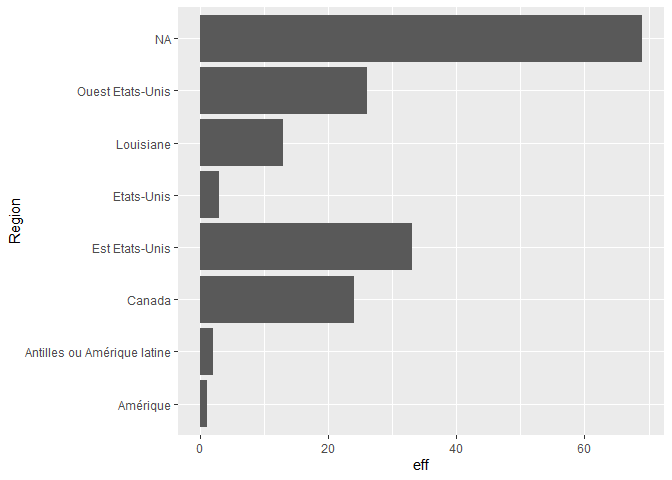


Figure 1: Graphique en bâton des différents sous-corpus du corpus
initial.

</div>

La
<a href="#fig-sous-corpus-comparaison" class="quarto-xref">Figure 1</a>
montre que sur les 171 ouvrages qui composent le corpus initial, 33
recouvrent la région de l’est des Etats-Unis. En comparaison avec les
autres régions, l’est des Etats-Unis est la région la plus représentée
du corpus initial après les N/A.

Projection de la courbe des ouvrages en fonction de l’année de
publication :

``` r
corpus_metadata_EastUS |>
  group_by(Date_edition_inf) |>
  summarize(Nombre = n()) |>
  mutate(Freqcum = cumsum(Nombre)) |>
  ggplot(aes(x = Date_edition_inf, y = Freqcum)) +
  geom_line() +
  labs(x = "Date", "Fréquences cumulées")
```

<div id="fig-distribution-temporelle">

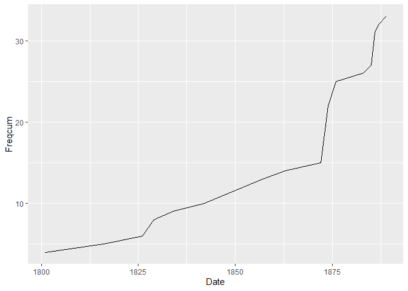


Figure 2: Courbe de la distribution temporelle des ouvrages du
sous-corpus EastUS (fréquences cumulées).

</div>

La courbe de la
<a href="#fig-distribution-temporelle" class="quarto-xref">Figure 2</a>
permet d’observer le nombre d’ouvrages, issus du sous-corpus, publiés au
XIXe siècle. On observe une fréquence de publication assez faible dans
la première moitié du XIXe siècle et une croissance exponentielle à
partir des années 1870 et notamment à partir de l’année 1875.

Projection du graphique en barre de la distribution temporelle des
ouvrages du sous-corpus :

``` r
corpus_metadata_EastUS |> 
  group_by(Date) |>
  summarise(eff = n()) |>
  ggplot(aes(x = Date, y=eff)) +
  geom_bar(stat = "identity") +
  coord_flip()
```

<div id="fig-distribution-graph">

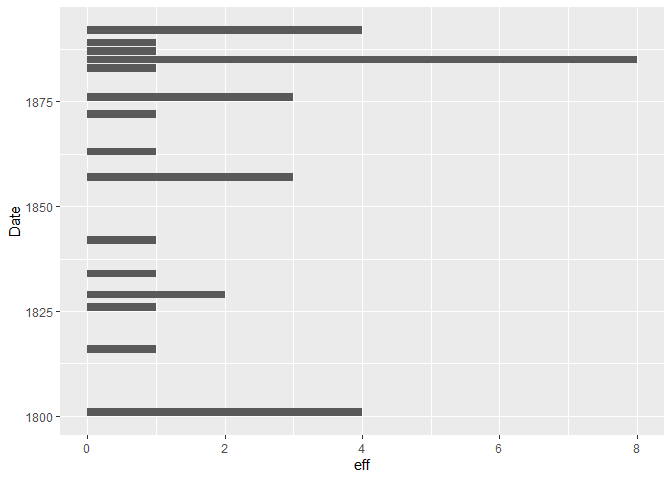


Figure 3: Graphique en bâton de la distribution temporelle des ouvrages
du sous-corpus EastUS.

</div>

La <a href="#fig-distribution-graph" class="quarto-xref">Figure 3</a>
coroborre l’obersvation de la courbe ci-dessous. Ces ouvrages ont tous
été publiés durant le XIXe siècle, mais à des années différentes.
L’années 1885 se distingue par la publication de 8 ouvrages, alors que
la première moitié du XIXe siècle reste assez pauvre en terme de
production.

Projection du graphique en barre de la nationalité des auteurs

``` r
corpus_metadata_EastUS |> 
  group_by(Nationalite) |>
  summarise(eff = n()) |>
  ggplot(aes(x = Nationalite, y=eff)) +
  geom_bar(stat = "identity") +
  coord_flip()
```

<div id="fig-graph-nationalite">

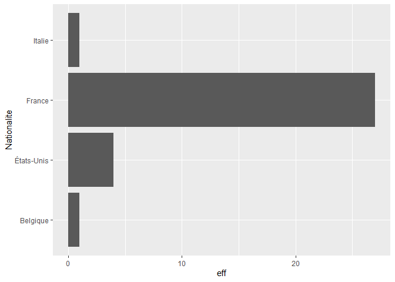


Figure 4: Graphique en bâton de la nationalité des auteurs du
sous-corpus EastUS.

</div>

La <a href="#fig-graph-nationalite" class="quarto-xref">Figure 4</a>
nous donne le détail de la nationalité des auteurs représentant notre
sous-corpus. On remarque qu’une grande majorité d’entre eux sont
Français, soit 27 ouvrages. Cela est intéressant pour notre analyse
puisque nous nous penchons sur le regard français sur les Etats-Unis.

Projection du graphique en barre de la production d’ouvrages par auteur
:

``` r
corpus_metadata_EastUS |> 
  group_by(Nom_auteur) |>
  summarise(eff = n()) |>
  ggplot(aes(x = Nom_auteur, y=eff)) +
  geom_bar(stat = "identity") +
  coord_flip()
```

<div id="fig-nom-auteur">

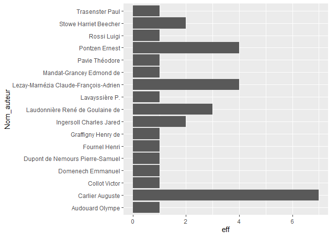


Figure 5: Graphique en bâton des noms des différents auteurs du
sous-corpus EastUS.

</div>

La <a href="#fig-nom-auteur" class="quarto-xref">Figure 5</a> montre que
la production d’ouvrages diffère selon les auteurs. Certains auteurs
sont plus prolifiques que d’autres à l’instar de Carlier Auguste qui a
écrit 7 ouvrages qui composent le sous-corpus EastUS. On remarque
également que la majorité des auteurs issus du sous-corpus n’ont écrit
qu’un seul ouvrage ou tome ce qui pose la question de la
représentativité.

Production du graphique en barre de la fonction des auteurs :

``` r
corpus_metadata_EastUS |> 
  group_by(Categorie_fonction) |>
  summarise(eff = n()) |>
  ggplot(aes(x = Categorie_fonction, y=eff)) +
  geom_bar(stat = "identity") +
  coord_flip()
```

<div id="fig-categorie-fonction">

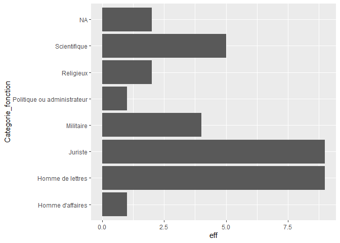


Figure 6: Graphique en bâton des fonctions des auteurs du sous-corpus
EastUS.

</div>

La <a href="#fig-categorie-fonction" class="quarto-xref">Figure 6</a>
met en exergue que les fonctions des auteurs sont assez variées, mais
certaines se distinguent plus que les autres. En effet, les fonctions
“Hommes de lettres” et “Juristes” sont les plus représentés, alors qu’on
a qu’un seul homme d’affaires et politique/administrateur. Cette plus
grande représentativité des hommes de lettres et des juristes est
intéressante à prendre en compte dans l’analyse des ouvrages lorsque
nous aborderons les différents thèmes qui composent ces ouvrages.

Projection du graphique en barre du sexe des auteurs :

``` r
corpus_metadata_EastUS |> 
  group_by(Sexe) |>
  summarise(eff = n()) |>
  ggplot(aes(x = Sexe, y=eff)) +
  geom_bar(stat = "identity") +
  coord_flip()
```

<div id="fig-sexe-auteur">

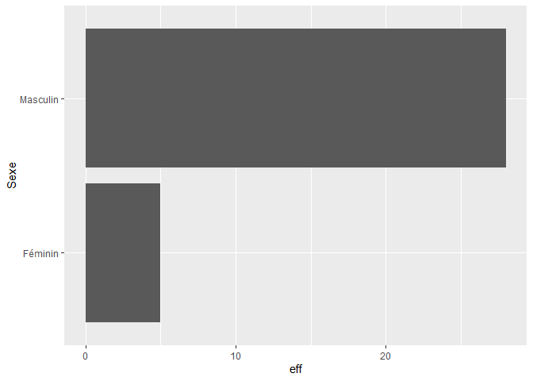


Figure 7: Graphique en bâton sur le genre des auteurs du sous-corpus
EastUS.

</div>

La <a href="#fig-sexe-auteur" class="quarto-xref">Figure 7</a> montre
que le sexe masculin est très majoritairement représenté dans le
sous-corpus EastUS avec 28 auteurs.

# Présentation des principales caractéristiques textométriques du sous-corpus

## Segmentation lexicale (*tokenization*)

Nous allons maintenant procéder à la **segmentation lexicale** du
vocabulaire du sous-corpus avec les fonctions `tokens()` et
`tokens_split()` de *quanteda*. Cette dernière permet d’utiliser les
apostrophes comme un caractère séparateur permettant de découper les
mots du corpus.

``` r
tokens_EastUS <- tokens (EastUS,
                         remove_punct = TRUE,
                         remove_symbols = TRUE,
                         remove_numbers = TRUE)
tokens_EastUS <- tokens_split(tokens_EastUS, "'")
tokens_EastUS <- tokens_split(tokens_EastUS, "’")
```

## Taille du sous-corpus

Commençons par compter le nombre total de mots (**occurrences**)
présents dans le corpus.

``` r
sum(ntoken(EastUS))
```

    [1] 4423640

La fonction `ntype()` permet de compter le nombre de **formes** dans
chaque document du corpus.

``` r
sum(ntype(EastUS))
```

    [1] 439085

Modélisation “sac de mots” du corpus. On utilise la fonction `dfm()` de
`quanteda` pour construire la matrice documents-termes du corpus.

``` r
EastUS_dfm <- dfm(tokens_EastUS)
```

La modélisation thématiques des données textuelles sous la forme de
vecteurs induit la création d’un “sac de mots” (*bag of words*) qui
représente chaque document de notre sous-corpus sous la forme d’un
vecteur correspondant à son dictionnaire de fréquence. Ainsi, la DFM
(*Document-Feature-Matrix*) qui, rassemble les vecteurs, désigne une
matrice où les lignes correpondent aux documents (dans notre cas les
paragraphes. *cf. Définition de l’unité documentaire*) et les colonnes à
l’unité lexicale (lemme).

## Courbe de Pareto

La <a href="#fig-courbe-pareto" class="quarto-xref">Figure 8</a> a été
modélisée grâce à la fonction `plot_pareto`. Elle permet d’avoir une vue
d’ensemble de la distribution des mots dans le sous-corpus.

``` r
plot_pareto(EastUS_dfm)
```

<div id="fig-courbe-pareto">

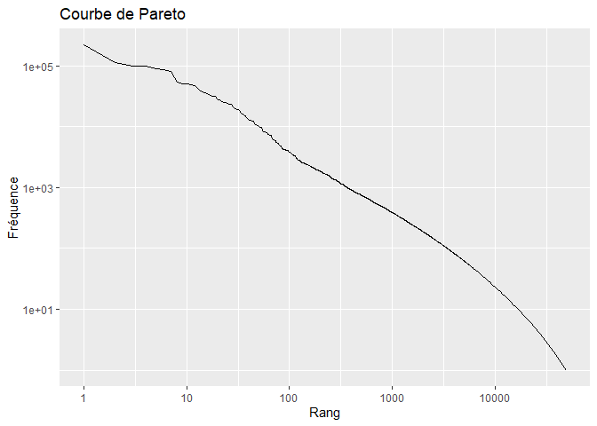


Figure 8: Représentation de la courbe de pareto du sous-corpus EastUS.

</div>

## Comparaison de la taille des documents

Nous procédons à la comparaison de la taille des documents du
sous-corpus :

``` r
groups <- group_sizes(EastUS_dfm, part="Numm")
plot_group_sizes(groups = groups, part="Numm")
```

<div id="fig-taille-documents">

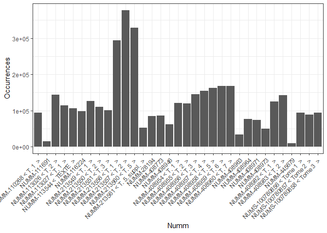


Figure 9: Graphique en bâton concernant la taille des ouvrages du
sous-corpus EastUS.

</div>

Le sous-corpus EastUS, issu du corpus initial, est composé de 33
ouvrages. Autrement dit, sur les 171 documents du corpus initial, 33
recouvrent la région de l’est des Etats-Unis.

On remarque dans
<a href="#fig-taille-documents" class="quarto-xref">Figure 9</a> que les
tailles des différents ouvrages du sous-corpus diffèrent énormément.
Certains ouvrages sont beaucoup plus conséquents que d’autres, ce qui
pose un problème d’homogénéité, mais également un problème
d’exploitabilité. En effet, la différence de taille entre les documents
d’un même corpus peut biaiser l’analyse puisque les ouvrages volumineux
contiennent plus de mots et sont par conséquent plus représentatifs dans
le cadre d’une analyse quantitative et statistique. En comparaison, un
ouvrage court aura beaucoup moins de poids face à un ouvrage plus long.

## Première étude des formes les plus fréquentes

Nous pouvons calculer le **dictionnaire des fréquences** via la fonction
`textstat_frequency()` du paquet *quanteda.textstats*, ce qui nous
permet, dans le cadre de l’analyse de données textuelles, de repérer
quels sont les mots les plus fréquents dans notre sous-corpus.

``` r
lexique_EastUS <- textstat_frequency(EastUS_dfm)
View(lexique_EastUS)
```

A l’issue de cette commande, nous obtenons un tableau comprenant le
lexique du sous-corpus et affichant les mots ayant la fréquence la plus
élevée jusqu’aux mots ayant la fréquence la moins élevée.

## Proportion d’Hapax

Un hapax est un phénomène rare. Ce terme désigne les mots qui ont une
fréquence très faible. Il sont différents des mots outils. Les hapax
comprennent généralement entre 40% à 60% des mots. Nous avons fait le
choix de considérer comme hapax tous les mots n’ayant qu’une seule
apparition dans le corpus à l’aide du code suivant :

``` r
nb_hapax <- sum(lexique_EastUS == 1)
```

Nous obtenons le résultat suivant : 107600. Ainsi, notre sous-corpus
contient, sur 4423640 occurences, 107600 hapax.

# Explication des prétraitements

## Retrait des mots outils

Les mots outils ou *stop words* en anglais sont des mots ayant un rôle
grammatical ou syntaxique dans une phrase, mais ils n’apportent pas
grand-chose au contenu lexical, autrement dit, ils ne servent pas à
grand-chose s’ils sont pris séparemment. Les mots-outils désignent
principalement les pronoms, les adverbes, les articles, etc. Ils sont
très fréquents, mais ils n’ont pas d’utilité pour déterminer des thèmes
précis. Ainsi, pour ne pas biaiser la recherche de thèmes, il nous faut
filtrer ces mots-outils.

On filtre les mots outils présents dans cette liste de tokens à partir
du code suivant :

``` r
stopwords_fr <- read.csv("stopwords_fr.csv", encoding = "utf-8")
toks_nostop <- tokens_remove(tokens_EastUS,
                             stopwords_fr$fg,
                             padding=FALSE)
```

On compare les caractéristiques du corpus après avoir retiré les mots
outils du corpus.

``` r
sum(ntoken(toks_nostop))
```

    [1] 1645980

``` r
sum(ntype(toks_nostop))
```

    [1] 374942

## Définition de l’unité documentaire

La <a href="#fig-taille-documents" class="quarto-xref">Figure 9</a> a
mis en lumière la nécessité de découper les documents composant notre
sous-corpus en plus petites unités homogènes pour pouvoir les comparer
de manière équitable. C’est dans cette optique que nous avons choisi
collectivement de découper les ouvrages en paragraphes évitant la
sureprésentation des longs textes. De plus, un paragraphe correspond
souvent à une idée ou à un thème particulier ce qui est très intéressant
dans notre démarche de trouver des thèmes rapidement via des méthodes de
*topic modeling* comme LDA.

Nous découpons les 33 ouvrages du sous-corpus en fonction des
paragraphes. Pour cela nous allons détecter tous les sauts de ligne
symbolisés par “”. Nous procédons au découpage à l’aide du code suivant
:

``` r
ss_corpus_par <- corpus_segment(EastUS, pattern = "\n")
```

Avec le découpage du corpus en fonction des paragraphes, on obtient un
objet qui contient une liste de listen de 178603 documents au sein de
notre sous-corpus. Chaque document est un paragraphe. Mais ce découpage
par paragraphe n’est pas parfait puisqu’il compte également les
paragraphes vides, les numéros de chapitre, les paragraphes très courts,
etc. C’est pouquoi nous procédons à la tokénisation de ce nouveau corpus
de paragraphes ci-dessous.

``` r
tokens_par <- tokens(ss_corpus_par,
                     remove_punct = TRUE,
                     remove_symbols = TRUE,
                     remove_numbers = TRUE)
tokens_par <- tokens_split(tokens_par, "'")
tokens_par <- tokens_split(tokens_par, "’")
```

Ensuite, nous construisons un DFM en filtrant les paragraphes vides et
les termes dont l’occurence est faible, autrement dit les hapax :

``` r
dfm_ss_corpus <- dfm(toks_nostop,
                     remove_padding = TRUE)


dfm_ss_corpus <- dfm_trim(dfm_ss_corpus,
                          min_termfreq = 5)

dfm_ss_corpus <- dfm_subset(dfm_ss_corpus,
                            ntoken(dfm_ss_corpus) > 0,
                            drop_docid = FALSE)
```

# Vers une première approche des thèmes

Il s’agit de faire une première démarche expérimentale pour déterminer
un nombre de *topics* à modéliser via la méthode LDA (*Allocation de
Dirichlet latente*). C’est un algorithme faisant partie des méthodes de
*topic modeling* (Cointet et Parasie (2018)) et qui a été mis au point
en 2003 par David Blei, dont l’objectif est de détecter des thèmes dans
un ensemble de documents. C’est une méthode statistique qui marche avec
une loi de probabilité.

On fait une première modélisation avec 5 *topics* :

``` r
res_lda <- LDA(dfm_ss_corpus, k=5, method="Gibbs",
               control = list(iter = 500,
                              verbose = 25,
                              seed=1307))
```

    K = 5; V = 26653; M = 33
    Sampling 500 iterations!
    Iteration 25 ...
    Iteration 50 ...
    Iteration 75 ...
    Iteration 100 ...
    Iteration 125 ...
    Iteration 150 ...
    Iteration 175 ...
    Iteration 200 ...
    Iteration 225 ...
    Iteration 250 ...
    Iteration 275 ...
    Iteration 300 ...
    Iteration 325 ...
    Iteration 350 ...
    Iteration 375 ...
    Iteration 400 ...
    Iteration 425 ...
    Iteration 450 ...
    Iteration 475 ...
    Iteration 500 ...
    Gibbs sampling completed!

``` r
gamma_df <- get_gamma(res_lda)
beta_df <- get_beta(res_lda)
```

``` r
plot_tm(beta_df, 10)
```

<div id="fig-Modelisation-LDA-Topics-5">

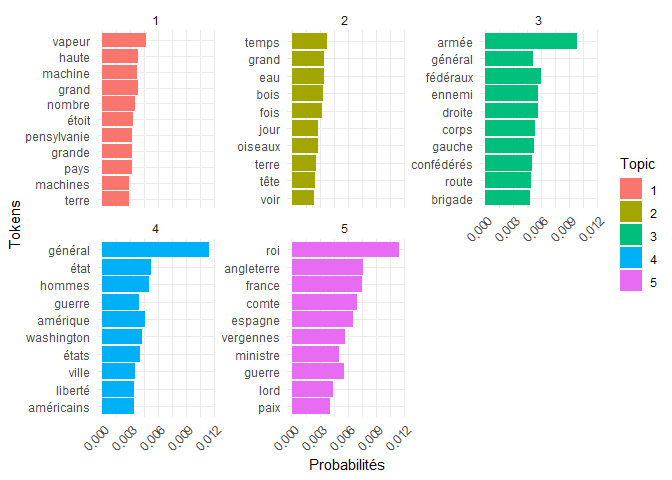


Figure 10: Modélisation LDA de 5 topics.

</div>

La méthode LDA repose sur deux théories principales :

- Un *topic* est une collection de mots ;
- Un document est une collection de *topic.*

Ces deux théories sont confirmées par le code suivant :

``` r
gamma_df |>
  group_by(Document) |>
  summarise(Proba = sum(Probability)) |>
  View()
  
beta_df |>
  group_by(Topic) |>
  summarise(Proba = sum(Probability)) |>
  View()
```

On constate avec la matrice gamma que si on fait la somme des
probabilités de chaque *topic* pour un document, on obtient 1. C’est la
démonstration qu’un document est une collection de *topics*. Ces
*topics*, selon les documents vont être plus ou moins représentés,
autrement dit, avoir des probabilités plus ou moins forte.

Avec la matrice beta, on fait le constat que si on fait la somme des
probabilités des *tokens* d’un corpus, on obtient un total de 1 pour
chaque *topic*. C’est la démonstration qu’un *topic* est une collection
de *tokens*. Chaque *token* va avoir une probabilité plus ou moins forte
dans un *topic* donné.

## Evaluation de la modélisation thématique à l’aide de la cohérence

La cohérence permet d’évaluer la “cohérence sémantique”, c’est-à-dire
qu’elle permet de mesurer les mots les plus récurrents dans un *topic*
qui ont plus de chance d’être dans les mêmes documents. Autrement dit,
on considère que la cohérence d’un *topic* est d’autant plus forte que
les mots qui le composent ont plus de chance d’être souvent employés
ensemble dans les mêmes documents.

La fonction `topic_cohrence()` mesure la fréquence à laquelle les
principaux *tokens* de chaque *topic* apparaissent ensemble dans le même
document. Un bon score de cohérence indique la pertinence d’un *topic*.
Ici, nous prenons 50 mots pour chaque *topic*.

``` r
coherence <- topic_coherence(res_lda, dfm_ss_corpus, top_n_tokens = 50)
```

La fonction `mean()` permet d’obtenir la moyenne d’un ensemble de
valeurs. Dans notre cas, elle calcule la moyenne des scores de cohérence
des *topics* obtenus par la méthode LDA. Elle nous permet donc de voir
si les thèmes sont cohérents. Plus le score est proche de 0 plus la
cohérence du *topic* est pertinente.

``` r
mean(coherence)
```

    [1] -227.2867

Nous obtenons une moyenne de -227.2867, soit un résultat assez négatif.
Autrement dit, on a une faible cohérence sémantique entre les mots des
*topics*. Les mots n’apparaissent pas souvent dans les mêmes documents.
Cela induit un changement du nombre de *topic*.

La fonction `k_estimation()` permet d’observer l’évolution de la
cohérence moyenne selon les variations du nombre de *topics* à
modéliser. Elle est utilisée pour essayer différents nombres de *topics*
dans une modélisation LDA dans l’objectif de déterminer quelle valeur de
`k` octroie la meilleure cohérence.


La courbe de l’évolution de la cohérence montre que le nombre de *topic*
influe sur la cohérence. Ainsi, plus on augmente le nombre de *topics*
moins la cohérence est pertinente. En effet, après le *topic* 12, on
remarque que la cohérence se maintient vers une moyenne de -360, voire
moins, ce qui n’est pas intéressant dans notre cas car un nombre trop
élevé de *topics* rend l’analyse moins pertinente.

Ainsi, d’après la courbe de l’évolution de la cohérence par nombre de
*topics*, il serait intéressant de nous arrêter à cinq, à huit ou à
douze *topics* car ils ont un meilleur score de cohérence et ont plus de
chance de regrouper les mêmes mots au sein d’un seul *topic*. En effet,
nous avons une petite croissance au niveau du douzième *topic.* Pour
mieux guider notre choix il faut faire une analyse qualitative et
regarder de près les mots dans les *topics* afin de déterminer la
pertinence des *topics*. Prendre un nombre de *topic* ayant un bon score
de cohérence n’est pas forcément le meilleur choix. Enfin, le choix d’un
petit nombre de *topics* peut également biaiser l’analyse et restreindre
les interprétations, c’est-à-dire ne pas être représentatif de tout le
sous-corpus. Et inversement, prendre trop de *topics* peut rendre les
thèmes redondants et donc moins pertinents.

Nous proposons de nous intéresser à une modélisation de cinq, huit et
douze *topics* et de voir lesquels sont les plus pertinents.

On fait une seconde modélisation LDA avec 8 topics :

``` r
res_lda <- LDA(dfm_ss_corpus, k=8, method="Gibbs",
               control = list(iter = 500,
                              verbose = 25,
                              seed=1307))
```

    K = 8; V = 26653; M = 33
    Sampling 500 iterations!
    Iteration 25 ...
    Iteration 50 ...
    Iteration 75 ...
    Iteration 100 ...
    Iteration 125 ...
    Iteration 150 ...
    Iteration 175 ...
    Iteration 200 ...
    Iteration 225 ...
    Iteration 250 ...
    Iteration 275 ...
    Iteration 300 ...
    Iteration 325 ...
    Iteration 350 ...
    Iteration 375 ...
    Iteration 400 ...
    Iteration 425 ...
    Iteration 450 ...
    Iteration 475 ...
    Iteration 500 ...
    Gibbs sampling completed!

``` r
gamma_df <- get_gamma(res_lda)
beta_df <- get_beta(res_lda)
```

``` r
plot_tm(beta_df, 10)
```

<div id="fig-Modelisation-LDA-Topics-8">

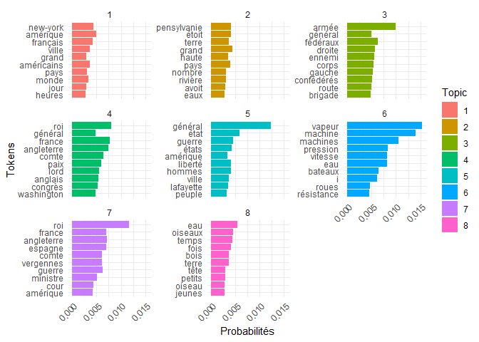


Figure 11: Modélisation LDA de 8 topics.

</div>

On fait une seconde troisième modélisation avec 12 *topics* :

``` r
res_lda <- LDA(dfm_ss_corpus, k=12, method="Gibbs",
               control = list(iter = 500,
                              verbose = 25,
                              seed=1307))
```

    K = 12; V = 26653; M = 33
    Sampling 500 iterations!
    Iteration 25 ...
    Iteration 50 ...
    Iteration 75 ...
    Iteration 100 ...
    Iteration 125 ...
    Iteration 150 ...
    Iteration 175 ...
    Iteration 200 ...
    Iteration 225 ...
    Iteration 250 ...
    Iteration 275 ...
    Iteration 300 ...
    Iteration 325 ...
    Iteration 350 ...
    Iteration 375 ...
    Iteration 400 ...
    Iteration 425 ...
    Iteration 450 ...
    Iteration 475 ...
    Iteration 500 ...
    Gibbs sampling completed!

``` r
gamma_df <- get_gamma(res_lda)
beta_df <- get_beta(res_lda)
```

``` r
plot_tm(beta_df, 10)
```

<div id="fig-Modelisation-LDA-Topics-12">

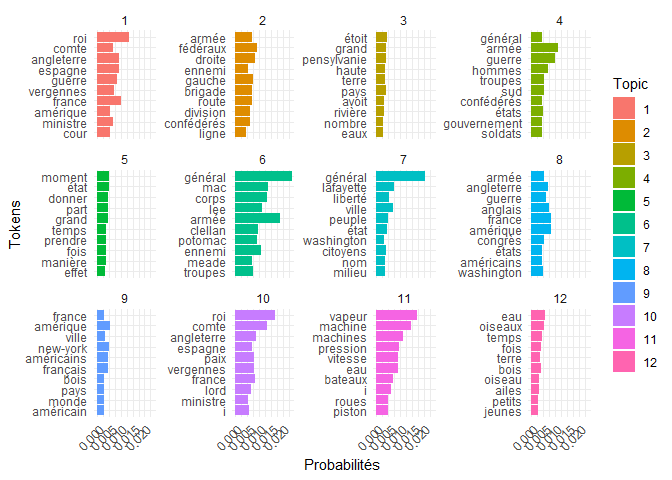


Figure 12: Modélisation LDA de 12 topics.

</div>

## Description des *topics*

Ainsi, après avoir modélisé cinq, huit et douze *topics* nous pouvons en
tirer plusieurs conclusions après les avoir regardés en détail. Une
modélisation à 5 *topics* <a href="#fig-Modelisation-LDA-Topics-5"
class="quarto-xref">Figure 10</a> offre le meilleur score de cohérence
et donc une meilleure pertinence et interprétation. On parvient à
distinguer clairement les *topics* (industrialisation, nature, guerre,
politique, relations internationales), mais ce sont des thèmes assez
généraux sans rentrer dans les détails, surtout si on prend en compte
nos nombreux documents. Donc nous perdons en précision, ce qui ne permet
pas de nuancer, mais nous gagnons en généralité. La
<a href="#fig-Modelisation-LDA-Topics-5"
class="quarto-xref">Figure 10</a> nous montre une modélisation des 5
*topics* ayant la cohérence la plus élevée. Le *topic* 1 semble aborder
le thème de l’industrialisation, en effet, l’Etat de Pennsylvanie est
l’un des Etats les plus industrialisés des Etats-Unis. Les termes de
machines, vapeur semblent corroborer cette idée. Une lecture plus proche
vient confirmer ce thème, en effet, on a des ouvrages parlant de voyages
en Pennsylavnie et des descriptions de machines à vapeur. Le *topic* 2
aborde le thème de la nature et des paysages comme le montrent les
termes eau, bois, oiseaux, temps, jour, etc. Le *topic* 3 aborde le
thème de la guerre et plus précisément de la guerre de Sécession. Le
*topic* 4 reste assez vague, mais est peut-être concentré sur le
contexte politique des Etats-Unis. Enfin, le *topic* 5 semble aborder
les questions de relations internationales et de diplomatie.

La modélisation à huit *topics* <a href="#fig-Modelisation-LDA-Topics-8"
class="quarto-xref">Figure 11</a> offre quant à elle plus de détails et
une analyse plus fine mais on voit que certains termes reviennent dans
plusieurs *topics* comme le mot “roi”, “france” ou bien “amérique”.
Néanmoins, cette redondance n’est pas forcément un désavantage puisqu’on
comprend avec les autres mots du *topic* qu’il ne s’agit pas de la même
chose. Par exemple, dans les *topics* 4 et 7, il s’agit de relations
internationales différentes, l’une avec l’Espagne, l’Angleterre et
l’autre avec la France et l’Angleterre. La cohérence est certes moins
bonne mais on gagne en précision et les *topics* sont relativement
simples à interpréter. Le *topic* 1 semble aborder la question des
Français vivant sur la côte est des Etats-Unis, notamment dans des
villes comme New York. En effet, on sait que de nombreux voyageurs
viennent aux Etats-Unis et décrivent le pays au XIXe siècle. Le *topic*
2 aborde la description des paysages de l’Etats de Pennsylvanie, donc un
thème sur la nature ou encore sur la topographie. Le *topic* 3 semble
lié au thème de la guerre et peut-être en lien avec la guerre de
Secession puisqu’on retrouve les termes de fédérés et de confédérés. Le
*topic* 4 aborde également la question des relations diplomatiques entre
la France, les Etats-Unis et l’Angleterre. On sait également que de
nombreux Français ont participé à la guerre de Sécession. Le *topic* 5
aborde peut-être le voyage de La Fayette dans les années 1820 aux
Etats-Unis. Le *topic* 6 semble aborder l’industrialisation qui est
effectivement intense durant la seconde moitié du XIXe siècle sur la
côte est des Etats-Unis et notamment dans les Etats du Nord. Le *topic*
7 semble aborder les relations diplomatiques entre la France,
l’Angleterre et les Etats-Unis. La présence de Vergennes, ministre des
Affaires étrangères français, pendant la guerre de Secession semble
corroborer cela. Enfin, le *topic* 8 aborde le thème de la nature et de
l’environnement avec des termes comme “oiseaux”, “forêt”, etc. Ainsi, la
modélisation à 8 *topics* semble rester relativement cohérente et nous
arrivons à interpréter les thèmes avec une certaine précision.

La modélisation à douze *topics*
<a href="#fig-Modelisation-LDA-Topics-12"
class="quarto-xref">Figure 12</a> a le score de cohérence le plus
faible. On constate l’apparition de termes assez vagues comme les “i” ou
bien la redondance de certains thèmes comme les *topics* 2 et 4 qui sont
assez semblables, ce qui ne nous permet pas de déceler une différence.
Si cette modélisation nous permet de dégager plus de thèmes, nous
perdons en qualité interprétative, certains thèmes restent assez vagues
et non explicites.

Ainsi, le meilleur choix semble se porter soit sur une modélisation à
cinq *topics* soit sur une modélisation à huit *topics*. L’un offre un
aperçu général des thèmes du sous-corpus tandis que l’autre offre une
meilleure précision tout en restant cohérent dans l’ensemble. Les
principaux thèmes de notre sous-corpus se concentrent sur la guerre de
Secession, ’l’industrialisation, la description de l’est des Etats-Unis
et les relations internationales et les échanges diplomatiques.

<div id="refs" class="references csl-bib-body hanging-indent"
entry-spacing="0">

<div id="ref-ameur2011" class="csl-entry">

Ameur, Farid. 2011. « Les Français dans la guerre de Sécession,
1861-1865 ». *Bulletin de l’Institut Pierre Renouvin* 33 (1): 129‑39.
<https://doi.org/10.3917/bipr.033.0129>.

</div>

<div id="ref-cointet2018" class="csl-entry">

Cointet, Jean-Philippe, et Sylvain Parasie. 2018. « Ce que le big data
fait à l’analyse sociologique des textes:Un panorama critique des
recherches contemporaines ». *Revue française de sociologie* 59 (3):
533‑57. <https://doi.org/10.3917/rfs.593.0533>.

</div>

<div id="ref-durpaire2025" class="csl-entry">

Durpaire, François. 2025. « Chapitre IV. Les États désunis
(1863-1877) ». In, 7e éd.:44‑55. Que sais-je ? Paris cedex 14: Presses
Universitaires de France.
<https://shs.cairn.info/histoire-des-etats-unis--9782715430167-page-44?lang=fr>.

</div>

<div id="ref-fohlen1990" class="csl-entry">

Fohlen, Claude. 1990. « Perspectives historiques sur l’immigration
française aux États-Unis ». <https://doi.org/10.3406/remi.1990.1225>.

</div>

<div id="ref-mayaffre2002" class="csl-entry">

Mayaffre, Damon. 2002. « Les corpus réflexifs : entre architextualité et
hypertextualité ». *Corpus*, nᵒ 1 (novembre).
<https://doi.org/10.4000/corpus.11>.

</div>

<div id="ref-pincemin2012" class="csl-entry">

Pincemin, Bénédicte. 2012. « Hétérogénéité des corpus et textométrie ».
*Langages* 187 (3): 13‑26. <https://doi.org/10.3917/lang.187.0013>.

</div>

<div id="ref-sy-wonyu2004" class="csl-entry">

Sy-Wonyu, Aïssatou. 2004. « Les États-Unis et le monde au 19e siècle ».
<https://doi.org/10.3917/arco.wonyu.2004.01>.

</div>

</div>
