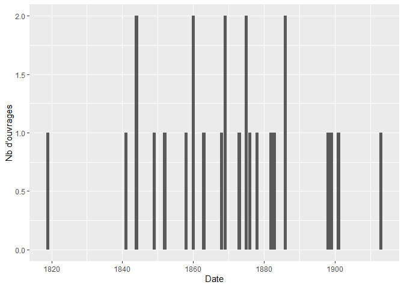
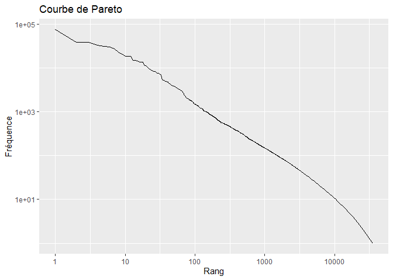
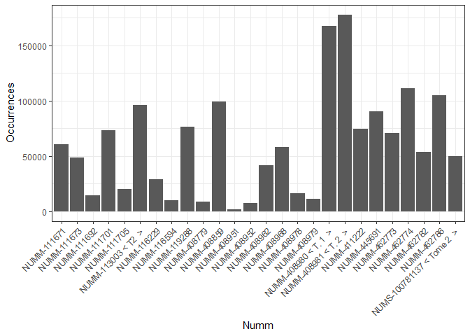
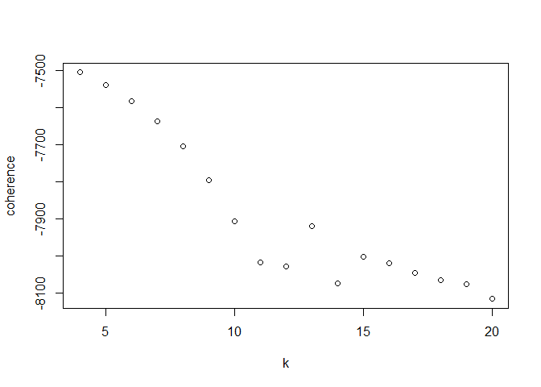
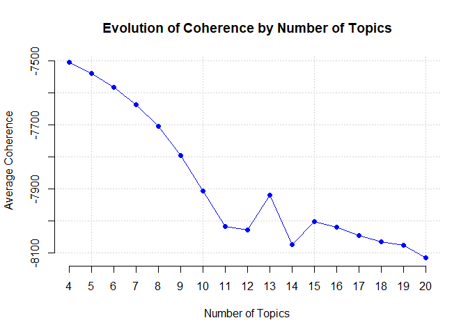
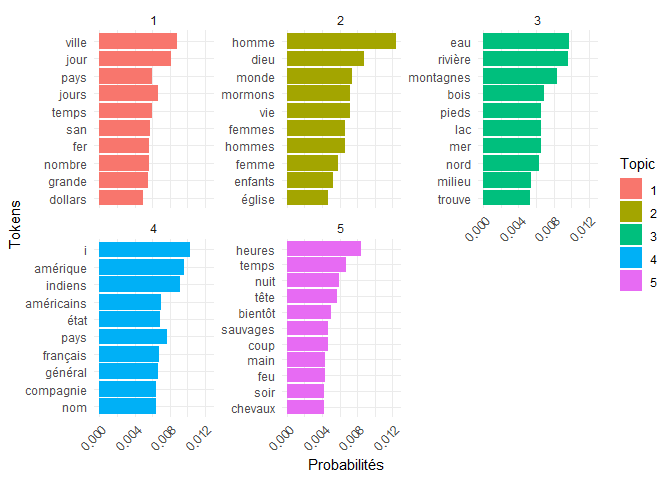
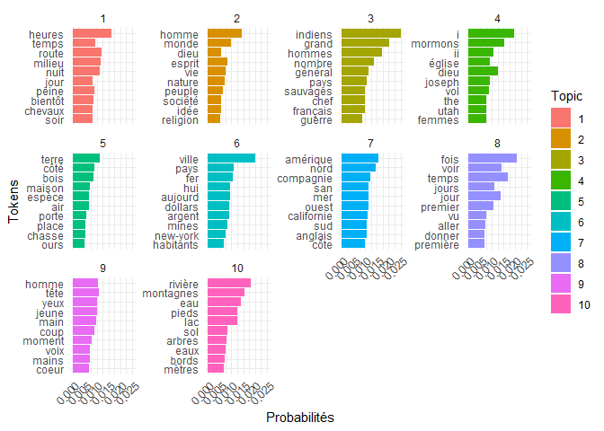
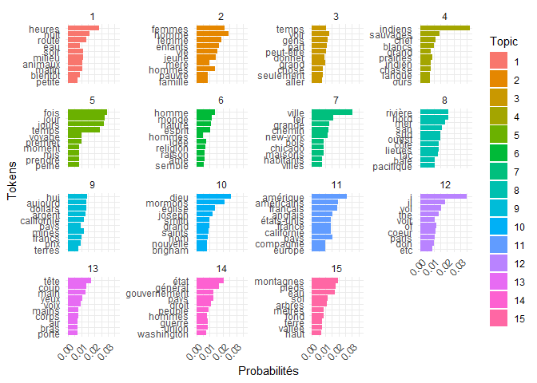

# Analyse du sous corpus amérique
Raphaël Le Querler
2025-05-06

- [Présentation analytique du sous-corpus
  choisi](#présentation-analytique-du-sous-corpus-choisi)
  - [Positionnement du sous corpus grâce aux caractéristiques d’Antoine
    Prost](#positionnement-du-sous-corpus-grâce-aux-caractéristiques-dantoine-prost)
  - [Et grâce aux critères de Bénédicte Pincemin (Pincemin
    2012)](#et-grâce-aux-critères-de-bénédicte-pincemin-pincemin_heterogeneite_2012)
- [Présentation des principales caractéristiques textométriques du
  sous-corpus](#présentation-des-principales-caractéristiques-textométriques-du-sous-corpus)
  - [Segmentation lexicale
    (*tokenization*)](#segmentation-lexicale-tokenization)
  - [Taille du sous-corpus](#taille-du-sous-corpus)
  - [proportion d’Hapax](#proportion-dhapax)
  - [courbe de Pareto](#courbe-de-pareto)
  - [Taille des documents du
    sous-corpus](#taille-des-documents-du-sous-corpus)
  - [Redéfinition de l’unité
    documentaire](#redéfinition-de-lunité-documentaire)
- [Une première approche des topics: choisir le nombre de topics à
  analyser](#une-première-approche-des-topics-choisir-le-nombre-de-topics-à-analyser)
  - [Une donnée théorique : le calcul de la
    cohérence](#une-donnée-théorique--le-calcul-de-la-cohérence)
  - [Evaluer notre modélisation thématique: l’analyse des
    topics.](#evaluer-notre-modélisation-thématique-lanalyse-des-topics)
    - [Topic n°1 : heures, temps, route, milieu, nuit, jour, peine,
      bientôt, chevaux,
      soir](#topic-n1--heures-temps-route-milieu-nuit-jour-peine-bientôt-chevaux-soir)
    - [Topic n°2 : homme, monde, dieu, esprit, vie, nature, peuple,
      société, idée,
      religion](#topic-n2--homme-monde-dieu-esprit-vie-nature-peuple-société-idée-religion)
    - [Topic n°3: indiens, grand, hommes, nombre, général, pays,
      sauvages, chef, français,
      guerre](#topic-n3-indiens-grand-hommes-nombre-général-pays-sauvages-chef-français-guerre)
    - [Topic n°4: i, mormons, il, église, dieu, joseph, vol, the, utah,
      femmes (Rieupeyrout
      2023)](#topic-n4-i-mormons-il-église-dieu-joseph-vol-the-utah-femmes-rieupeyrout_histoire_2023)
    - [Topic n°5: terre, côté, bois, maison, espèce, air, porte, place,
      chasse, ours (Villerbu
      2023)](#topic-n5-terre-côté-bois-maison-espèce-air-porte-place-chasse-ours-villerbu_nouvelle_2023)
    - [Topic n°6: ville, pays, fer, hui, aujourd, dollars, argent,
      mines, new-york, habitants (Villerbu
      2023)](#topic-n6-ville-pays-fer-hui-aujourd-dollars-argent-mines-new-york-habitants-villerbu_nouvelle_2023)
    - [Topic n°7: amérique, nord compagnie, san, mer, ouest, californie,
      sud, anglais,
      côte](#topic-n7-amérique-nord-compagnie-san-mer-ouest-californie-sud-anglais-côte)
    - [Topic n°8: fois, voir, temps, jours, jour, premier, vu, aller,
      donner,
      première](#topic-n8-fois-voir-temps-jours-jour-premier-vu-aller-donner-première)
    - [Topic n°9: homme, tête, yeux, jeune, main, coup, moment, voix,
      mains,
      coeur](#topic-n9-homme-tête-yeux-jeune-main-coup-moment-voix-mains-coeur)
    - [Topic n°10: rivière, montagnes, eau, pieds, lac, sol, arbres,
      eaux, bords, mètres (Villerbu
      2007)](#topic-n10-rivière-montagnes-eau-pieds-lac-sol-arbres-eaux-bords-mètres-villerbu_conquete_2007)

# Présentation analytique du sous-corpus choisi

Il est avant tout important de replacer la construction de ce
sous-corpus.Suite a notre travail sur les bases de données du corpus
américain de la BNF, nous sommes rapidement arrivés à préciser certaines
choses et caractéristique des documents a notre dispositions. Par
exemple, un travail de recodage nous a été nécessaire afin de préciser
les dates de parutions, qui pouvaient ne pas être précises. De même,
nous avont rapidement compris qu’une catégorisation par zones
géographiques traitées pouvait être pertinent. En se concentrant sur les
vocabulaires de zones géographiques que nous avions obtenu grâce a TXM,
nous avons réussi a catégoriser les ouvrages par zones géographiques.
Après une distribution avec les autres membres du TD, j’ai choisi de me
concentrer sur les ouvrages publiés et traitant de l’Ouest Américain.

Par ailleurs, lors de notre premier semestre, nous avons acté que notre
analyse se concentrerait aussi sur les ouvrages paru au XIXe et XXe
siecle. En effet, c’est sur cette période que la plupart des ouvrages du
corpus originel ont été publiés.

Notre corpus est donc composé de textes écrits en français traitant de
l’ouest américain et publiés entre 1819 et 1913 (les limites des
ouvrages le composant, mais nous reviendront dessus)

\##Notre corpus et la notion d’heuristique (Mayaffre 2002)

La dimension heuristique de ce corpus réside dans la période meme de
publication des ouvrages. En effet, dans l’histoire américaine, ou dans
ce qu’on en imagine, le 19eme siecle est avant tout marqué par la guerre
de Sécession entre le nord et le sud des états unis, mais aussi par la
conquête de l’ouest. Cette deuxième entité historique, est encore
fondatrice du mythe américain. Bien loin des westerns et autres œuvres
de fiction relatant ces événements de la ruée à l’ouest, notre corpus
nous invite a nous interroger sur la perception de cet espace par les
auteurs francophones, contemporains des faits.

## Positionnement du sous corpus grâce aux caractéristiques d’Antoine Prost

Si l’on suit les critères d’Antoine Prost, notre corpus est homogène. En
effet, il s’agit d’ouvrage exclusivement en français et traitant de
l’ouest américain. Cependant ces documents restent constrastifs sur leur
thèmes. En effet, parfois il s’agit d’ouvrage de géographie, parfois de
récits de voyages. ils n’ont pas tous le meme genre littéraire. Enfin la
diachronicité du corpus semble évidente. En effet la fenêtre de parution
de nos ouvrages s’étale entre 1819 et 1913. de plus, comme nous le
voyons sur <a href="#fig-courbe-publi" class="quarto-xref">Figure 1</a>,
la parution reste concentrée sur une période entre 1841 et 1886.
Cependant, meme si plus de 80% des ouvrages sont publiés sur cette
période, elle représente quand meme 40 ans, 40 ans durant lesquels les
regards ont pu changer.

## Et grâce aux critères de Bénédicte Pincemin (Pincemin 2012)

de plus, si l’on se réfère aux critères de Bénédicte Pincemin, la
signifiance du corpus reside dans la catégorisation en aire
géographique. tous les ouvrages possèdent un thème, celui de l’ouest
américain. Aussi, pour l’echelle de notre étude, le corpus de 25
ouvrages semble amplement suffisant et homogène, par la langue utilisée.
Le corpus est donc pleinement exploitable, selon les critères édictés
précedemment. Nous pouvons cependant soumettre quelques limites a ce
dernier. Tout d’abord, les ouvrages manquent parfois de catégorisation,
avec un genre littéraire par exemple, mais nous subissons aussi quelque
limites sur l’utilisation de R. En effet, à notre niveau plusieurs
fonctionnalités de R, et des différents packages disponibles, nos
connaissances nous mène rapidement a certaines limites, empechant de
nous permettre de faire une étude plus approfondies. Enfin une dernière
limite me semble importante a souligner. En effet, lors d’un visionnage
un peu plus attentifs du sous corpus, je me suis rendu compte que ce
dernier contenait 3 ouvrages qui sortaient de mon champs d’étude. En
effet parmi nos ouvrages, trois d’entre eux, sont centrés sur le
Klondiké, région de l’ouest canadien. bien que sortant de notre champs
d’étude, nous pouvons aisément déduire que cette erreur est liée a une
erreur de codage des zones géographiques, faite au premier semestre.
Cependant, ne pouvant les supprimer, nous faisons le choix contraint de
les conserver dans notre étude.

\#Chargement des paquets R nécessaires et setting du work directory.

On importe les textes du corpus avec `readtext`.

``` r
textes <- readtext("USA_wc.csv",
                   text_field= "text",
                   docid_field = "doc_id")
```

On crée le corpus dans `quanteda`.

``` r
corpus_wc<-corpus(textes)
```

Nous allons prétraiter le corpus en enlevant la ponctuation, les
apostrophes et en mettant toutes les lettres en minuscule. En bref on
tokenise notre corpus:

``` r
tokens_wc <- tokens(corpus_wc,
                    remove_punct = TRUE,
                    remove_symbols = TRUE,
                    remove_numbers = TRUE)

tokens_wc <- tokens_split(tokens_wc, "'")
tokens_wc <- tokens_split(tokens_wc, "’")
dfm_wc <- dfm(tokens_wc, tolower = FALSE)
```

On crée le *dataframe* des métadonnées

``` r
dataframe_wc<-docvars(corpus_wc)
```

Projection de la courbe des ouvrages en fonction de l’année de
publication :

``` r
dataframe_wc|>                  
  group_by(Date)|>                          
  summarize(Nombre=n())|>                   
  ggplot(aes(x=Date, y=Nombre)) +   
  geom_bar(stat="identity")+                              
  labs(x="Date", y="Nb d'ouvrages")
```

<div id="fig-courbe-publi">




Figure 1: Courbe de la distribution temporelle des ouvrages du
sous-corpus ouest américain (fréquences cumulées).

</div>

La courbe de la
<a href="#fig-courbe-publi" class="quarto-xref">Figure 1</a> permet
d’observer une croissance rapide du nombre d’ouvrages publiés jusqu’au
début des années 1860 avant que celle-ci ne ralentisse jusqu’au tournant
du XXe siècle.

# Présentation des principales caractéristiques textométriques du sous-corpus

## Segmentation lexicale (*tokenization*)

Nous allons maintenant procéder à la **segmentation lexicale** du
vocabulaire du sous-corpus avec les fonctions `tokens()` et
`tokens_split()` de *quanteda*. Cette dernière permet d’utiliser les
apostrophes comme un caractère séparateur permettant de découper les
mots du corpus.

Nous allons donc prétraiter notre corpus en enlevant la ponctuation, les
apostrophes et en gardant les majuscules des mots de notre corpus, ce
qui n’est pas automatique dans la fonction dfm(). En bref on tokenise
notre corpus:

``` r
tokens_wc <- tokens(corpus_wc,
                    remove_punct = TRUE,
                    remove_symbols = TRUE,
                    remove_numbers = TRUE)

tokens_wc <- tokens_split(tokens_wc, "'")
tokens_wc <- tokens_split(tokens_wc, "’")
wc_dfm <- dfm(tokens_wc, tolower = FALSE)
```

## Taille du sous-corpus

Commençons par compter le nombre total de mots (**occurrences**)
présents dans le corpus.

``` r
sum(ntoken(tokens_wc))
```

    [1] 1575532

La fonction `ntype()` permet de compter le nombre de **formes** dans
chaque document du corpus.

``` r
ntype(tokens_wc)
```

     extraction_bdd_19e.csv.10  extraction_bdd_19e.csv.13 
                         10597                      18045 
     extraction_bdd_19e.csv.14  extraction_bdd_19e.csv.21 
                         20920                      13392 
     extraction_bdd_19e.csv.28  extraction_bdd_19e.csv.29 
                          5225                      10730 
     extraction_bdd_19e.csv.30  extraction_bdd_19e.csv.35 
                         10069                       2781 
     extraction_bdd_19e.csv.56  extraction_bdd_19e.csv.62 
                         10023                      10128 
     extraction_bdd_19e.csv.64  extraction_bdd_19e.csv.71 
                          8920                      13345 
     extraction_bdd_19e.csv.73 extraction_bdd_19e.csv.101 
                         10207                       3105 
    extraction_bdd_19e.csv.104 extraction_bdd_19e.csv.110 
                          8805                       8894 
    extraction_bdd_19e.csv.118 extraction_bdd_19e.csv.149 
                          3112                       3613 
    extraction_bdd_19e.csv.155 extraction_bdd_19e.csv.156 
                          2038                       4900 
    extraction_bdd_19e.csv.157 extraction_bdd_19e.csv.158 
                         14324                       7991 
    extraction_bdd_19e.csv.162 extraction_bdd_19e.csv.163 
                         13940                      10727 
    extraction_bdd_19e.csv.167 extraction_bdd_19e.csv.168 
                           722                       2816 

pour avoir le total de forme il nous suffit d’entrer la commande
suivante:

``` r
sum(ntype(tokens_wc))
```

    [1] 229369

Il y a donc 229 369 formes verbales uniques dans notre corpus. En clair,
le corpus est composé de 229 369 mots uniques.

## proportion d’Hapax

le terme d’hapax vient du grec ancien et signifie originellement un
evennement ponctuel et extraordinaire n’apparaissant qu’une seule fois.
en textométrie il désigne les mots qui n’apparaissent qu’une seule fois
dans un corpus de document. Il est interressant de connaitre leur
proportion, car pour notre analyse il ne nous serviront pas. en effet,
en textométrie, nous étudions la répétition de termes dans un contexte
donné. Or si un terme n’apparait qu’une seule fois nous ne pouvon
l’analyser. afin de connaitre la proportion d’Hapax dans notre document,
il nous suffit d’entrer la commande suivante:

``` r
dico_freq <- textstat_frequency(wc_dfm)
nb_hapax<- sum(dico_freq==1)
print(nb_hapax)
```

    [1] 77748

Notre corpus est donc composé de 77 748 hapax, correspondant à 33% des
formes.

## courbe de Pareto

Grâce à la fonction plot_pareto, nous obtenons la courbe de Pareto qui
nous renseigne sur les distributions de terme dans notre sous corpus.

``` r
#| label: fig-courbe-pareto
#| fig-cap: "Courbe de Pareto sur le sous corpus Ouest américain"
plot_pareto(wc_dfm)
```



## Taille des documents du sous-corpus

Nous allons à présent étudier la taille des documents composants notre
sous corpus. Pour le faire nous allons utiliser la fonction

``` r
groups <- group_sizes(wc_dfm, part="Numm")
plot_group_sizes(groups = groups, part="Numm")
```

<div id="fig-diagramme-taille">




Figure 2: Comparaison de la taille des documents du sous-corpus

</div>

Ce tableau nous donne la taille de chaque document du sous corpus. comme
nous le voyons, leur taille varie grandement entre des ouvrage a moins
de 25 000 mots tandis que d’autres dépassent les 175 000 termes. afin de
produire une analyse plus efficace, nous devrons retravailler la
définition de l’unité documentaire, qui ne peut être l’ouvrage, tant les
ecarts sont importants.

\#Explicitation et prétraitement

Dans cette partie, nous commencerons à manipuler notre sous-corpus afin
de le prétraiter. Ces opérations préliminaires, ont pour but de
faciliter l’analyse de notre corpus.

\##Retrait des mots outils

Les mots outils désignent des unités linguistiques grammaticales
(articles, prépositions, conjonctions, pronoms, auxiliaires, etc.) qui
assurent la cohésion syntaxique et logique des énoncés, sans porter de
contenu lexical autonome. Leur fonction est principalement structurelle
dans l’organisation du discours. Ils nous sont donc inutiles pour une
analyse textométrique de corpus. présent en très grand nombre, il nous
faut les supprimer pour éviter des contres sens et des resultats peu
probant.

Pour cela nous allons utiliser un fichier *stopwords_fr.csv*. Ce dernier
recense les mots outils courants en francais afin de pouvoir les enlever
de notre analyse.

``` r
stopwords_fr <- read.csv("stopwords_fr.csv", encoding = "utf-8")


toks_nostop <- tokens_remove(tokens_wc,
                             stopwords_fr$fg,
                             padding=FALSE)
```

Nous allons à présent comparer les valeurs de *ntoken* et *ntype* apres
avoir enlever les mots outils.

``` r
dfm_doc <- dfm(toks_nostop)
sum(ntoken(dfm_doc))
```

    [1] 642062

``` r
sum(ntype(dfm_doc))
```

    [1] 204892

comme nous le remarquons \*\* METTRE LES REFERENCES AUX COMMANDES
AVANT\*\* le nombre de forme a legerement diminuer alors que je nombre
d’occurences a été diminué d’au moins 50%. cette diminution montre bien
l’importance des mots outils dans les corpus textuels.

Si l’on en suit les valeurs de ntype, avant le retrait des mots outils,
nous avions 229 369 formes différentes. Apres le retrait nous n’en avons
plus que 204 892, une rapide soustraction nous permet de déduire que 24
477 mots outils ont été enlevé. ce qui correspond donc a 10% de toutes
les formes du corpus.

Or, afin de mieux mesurer leur importance dans le corpus, nous allons
rapporter cette proportion a la proportion de token supprimer. Avant le
retrait des mots outils, il y avait 1 575 532 tokens dans le corpus, et
apres le retrait, il n’y a plus que 642 062 tokens. en effectuant une
soustraction, nous remarquons que 933 470 tokens ont été supprimer, ce
qui correspond a 59% du nombre total de tokens du corpus.

Les mots outils donc, ne composant que 10% de toute les formes uniques
du corpus, représentent plus de 59% des tokens composant le corpus. Il
semble donc plus que primordial de les enlever de notre corpus, afin de
faciliter les calculs, et de ne pas fausser les resultats.

## Redéfinition de l’unité documentaire

Comme nous l’avons vu avec notre première figure
<a href="#fig-diagramme-taille" class="quarto-xref">Figure 2</a>, les
ouvrages sont loins d’avoir la même taille. c’est pour cette raison que
nous allons redéfinir l’unité documentaire de notre analyse. Afin
d’avoir un cadre fixe, pouvant correspondre à une idée, nous avons
choisi de séparer nos documents en paragraphe. nous aurions pu choisir
de séparer en chapitre, cependant, dans le cas des romans par exemple,
un chapitre peut rassembler plusieurs idées. de plus, la taille plutôt
réduite d’un paragraphe, permet aussi de catégoriser plus aisément les
thèmes (topics sur lesquels nous reviendront plus tard), d’un texte.

De plus, de la même manière que les mots outils, les Hapax, ou les mots
apparessant trop rarement, ne nous servent pas dans notre analyse. en
effet, cette dernière se porte sur la répétission de termes dans des
contextes particuliers, un terme n’apparaissant que trop rarement ne
nous est donc pas utile, nous choisissons donc de les enlever.

Afin de mettre en place cette nouvelle répartition nous allons donc
rentrer les commandes suivantes:

``` r
ss_corpus_par <- corpus_segment(corpus_wc, pattern = "\n")

tokens_par <- tokens(ss_corpus_par,
                     remove_punct = TRUE,
                     remove_symbols = TRUE,
                     remove_numbers = TRUE)

tokens_par <- tokens_split(tokens_par, "'")
tokens_par <- tokens_split(tokens_par, "’")

stopwords_fr <- read.csv("stopwords_fr.csv", encoding = "utf-8")

toks_nostop <- tokens_remove(tokens_par,
                             stopwords_fr$fg,
                             padding=FALSE)
dfm_par <- dfm(toks_nostop,
               remove_padding = TRUE)


dfm_par <- dfm_trim(dfm_par,
                    min_termfreq = 5)

dfm_par <- dfm_subset(dfm_par,
                      ntoken(dfm_par) > 0,
                      drop_docid = FALSE)
```

# Une première approche des topics: choisir le nombre de topics à analyser

## Une donnée théorique : le calcul de la cohérence

Le topic modeling (ou modélisation de sujets) est une méthode d’analyse
statistique de corpus textuels qui permet d’identifier automatiquement
des thèmes (ou topics) latents à partir de la distribution des mots dans
les documents. Chaque topic est défini comme un ensemble de mots
fréquemment co-occurrents, et chaque document est représenté comme une
combinaison de ces topics en proportions variables.

Il existe plusieurs techniques d’analyse de topic, dans notre cas nous
allons utiliser la technique LDA. La LDA (Latent Dirichlet Allocation)
est un modèle probabiliste génératif qui vise à découvrir
automatiquement les topics (thèmes latents) dans un corpus de documents.
Chaque document est représenté comme un mélange de topics, et chaque
topic comme une distribution de probabilité sur les mots du vocabulaire.

Cependant pour faire un choix eclairer sur le nomnbre de topics que nous
allons analyser, nous allons calculer la cohérence des topics. Ce
calcul, permet de comparer ladite cohérence des topics, les uns par
rapport aux autres. De plus plus la valeur de la cohérence est proche de
zéro, plus le nombre de topic est cohérent.

``` r
res_lda_par <- LDA(dfm_par, k=5, method="Gibbs",
               control = list(iter=500,
                              verbose=25,
                              seed=1307))
```

    K = 5; V = 16749; M = 36459
    Sampling 500 iterations!
    Iteration 25 ...
    Iteration 50 ...
    Iteration 75 ...
    Iteration 100 ...
    Iteration 125 ...
    Iteration 150 ...
    Iteration 175 ...
    Iteration 200 ...
    Iteration 225 ...
    Iteration 250 ...
    Iteration 275 ...
    Iteration 300 ...
    Iteration 325 ...
    Iteration 350 ...
    Iteration 375 ...
    Iteration 400 ...
    Iteration 425 ...
    Iteration 450 ...
    Iteration 475 ...
    Iteration 500 ...
    Gibbs sampling completed!

``` r
gamma_dfpar <- get_gamma(res_lda_par)
beta_df_par <- get_beta(res_lda_par)

coherence<- topic_coherence(res_lda_par, dfm_par, top_n_tokens = 50)
mean(coherence)
```

    [1] -7446.847

``` r
k_estimation(dfm=dfm_par, min_k=4, max_k=20, n_tokens=50)
```

    [1] "==== Trial with k=4 ===="
    [1] "  --- Starting LDA 4 ---"
    [1] "  --- Ending LDA 4 ---"
    [1] "  --- Starting coherence calculation 4 ---"
    [1] "  --- Ending coherence calculation 4 ---"
    [1] "==== End of trial with k=4 ===="
    [1] "==== Trial with k=5 ===="
    [1] "  --- Starting LDA 5 ---"
    [1] "  --- Ending LDA 5 ---"
    [1] "  --- Starting coherence calculation 5 ---"
    [1] "  --- Ending coherence calculation 5 ---"
    [1] "==== End of trial with k=5 ===="
    [1] "==== Trial with k=6 ===="
    [1] "  --- Starting LDA 6 ---"
    [1] "  --- Ending LDA 6 ---"
    [1] "  --- Starting coherence calculation 6 ---"
    [1] "  --- Ending coherence calculation 6 ---"
    [1] "==== End of trial with k=6 ===="
    [1] "==== Trial with k=7 ===="
    [1] "  --- Starting LDA 7 ---"
    [1] "  --- Ending LDA 7 ---"
    [1] "  --- Starting coherence calculation 7 ---"
    [1] "  --- Ending coherence calculation 7 ---"
    [1] "==== End of trial with k=7 ===="
    [1] "==== Trial with k=8 ===="
    [1] "  --- Starting LDA 8 ---"
    [1] "  --- Ending LDA 8 ---"
    [1] "  --- Starting coherence calculation 8 ---"
    [1] "  --- Ending coherence calculation 8 ---"
    [1] "==== End of trial with k=8 ===="
    [1] "==== Trial with k=9 ===="
    [1] "  --- Starting LDA 9 ---"
    [1] "  --- Ending LDA 9 ---"
    [1] "  --- Starting coherence calculation 9 ---"
    [1] "  --- Ending coherence calculation 9 ---"
    [1] "==== End of trial with k=9 ===="
    [1] "==== Trial with k=10 ===="
    [1] "  --- Starting LDA 10 ---"
    [1] "  --- Ending LDA 10 ---"
    [1] "  --- Starting coherence calculation 10 ---"
    [1] "  --- Ending coherence calculation 10 ---"
    [1] "==== End of trial with k=10 ===="
    [1] "==== Trial with k=11 ===="
    [1] "  --- Starting LDA 11 ---"
    [1] "  --- Ending LDA 11 ---"
    [1] "  --- Starting coherence calculation 11 ---"
    [1] "  --- Ending coherence calculation 11 ---"
    [1] "==== End of trial with k=11 ===="
    [1] "==== Trial with k=12 ===="
    [1] "  --- Starting LDA 12 ---"
    [1] "  --- Ending LDA 12 ---"
    [1] "  --- Starting coherence calculation 12 ---"
    [1] "  --- Ending coherence calculation 12 ---"
    [1] "==== End of trial with k=12 ===="
    [1] "==== Trial with k=13 ===="
    [1] "  --- Starting LDA 13 ---"
    [1] "  --- Ending LDA 13 ---"
    [1] "  --- Starting coherence calculation 13 ---"
    [1] "  --- Ending coherence calculation 13 ---"
    [1] "==== End of trial with k=13 ===="
    [1] "==== Trial with k=14 ===="
    [1] "  --- Starting LDA 14 ---"
    [1] "  --- Ending LDA 14 ---"
    [1] "  --- Starting coherence calculation 14 ---"
    [1] "  --- Ending coherence calculation 14 ---"
    [1] "==== End of trial with k=14 ===="
    [1] "==== Trial with k=15 ===="
    [1] "  --- Starting LDA 15 ---"
    [1] "  --- Ending LDA 15 ---"
    [1] "  --- Starting coherence calculation 15 ---"
    [1] "  --- Ending coherence calculation 15 ---"
    [1] "==== End of trial with k=15 ===="
    [1] "==== Trial with k=16 ===="
    [1] "  --- Starting LDA 16 ---"
    [1] "  --- Ending LDA 16 ---"
    [1] "  --- Starting coherence calculation 16 ---"
    [1] "  --- Ending coherence calculation 16 ---"
    [1] "==== End of trial with k=16 ===="
    [1] "==== Trial with k=17 ===="
    [1] "  --- Starting LDA 17 ---"
    [1] "  --- Ending LDA 17 ---"
    [1] "  --- Starting coherence calculation 17 ---"
    [1] "  --- Ending coherence calculation 17 ---"
    [1] "==== End of trial with k=17 ===="
    [1] "==== Trial with k=18 ===="
    [1] "  --- Starting LDA 18 ---"
    [1] "  --- Ending LDA 18 ---"
    [1] "  --- Starting coherence calculation 18 ---"
    [1] "  --- Ending coherence calculation 18 ---"
    [1] "==== End of trial with k=18 ===="
    [1] "==== Trial with k=19 ===="
    [1] "  --- Starting LDA 19 ---"
    [1] "  --- Ending LDA 19 ---"
    [1] "  --- Starting coherence calculation 19 ---"
    [1] "  --- Ending coherence calculation 19 ---"
    [1] "==== End of trial with k=19 ===="
    [1] "==== Trial with k=20 ===="
    [1] "  --- Starting LDA 20 ---"
    [1] "  --- Ending LDA 20 ---"
    [1] "  --- Starting coherence calculation 20 ---"
    [1] "  --- Ending coherence calculation 20 ---"
    [1] "==== End of trial with k=20 ===="

        k coherence
    1   4 -7504.571
    2   5 -7538.707
    3   6 -7581.727
    4   7 -7636.897
    5   8 -7703.262
    6   9 -7795.258
    7  10 -7905.077
    8  11 -8015.760
    9  12 -8027.145
    10 13 -7917.828
    11 14 -8072.359
    12 15 -8000.654
    13 16 -8019.049
    14 17 -8045.631
    15 18 -8064.174
    16 19 -8076.389
    17 20 -8115.271

<div id="fig-tableau-coherence-1">




Figure 3: Evolution de la cohérence en fonction du nombre de topics
choisis

</div>
<div id="fig-tableau-coherence-2">




Figure 4: Evolution de la cohérence en fonction du nombre de topics
choisis

</div>

Comme nous le voyons, la cohérence est décroissante, plus le nombre de
topics augmente. Afin de voir lequel nous convient le mieux nous allons
essayer quelques uns d’entre eux et oberserverles resultats:

``` r
res_lda_par <- LDA(dfm_par, k=5, method="Gibbs",
               control = list(iter=500,
                              verbose=25,
                              seed=1307))
```

    K = 5; V = 16749; M = 36459
    Sampling 500 iterations!
    Iteration 25 ...
    Iteration 50 ...
    Iteration 75 ...
    Iteration 100 ...
    Iteration 125 ...
    Iteration 150 ...
    Iteration 175 ...
    Iteration 200 ...
    Iteration 225 ...
    Iteration 250 ...
    Iteration 275 ...
    Iteration 300 ...
    Iteration 325 ...
    Iteration 350 ...
    Iteration 375 ...
    Iteration 400 ...
    Iteration 425 ...
    Iteration 450 ...
    Iteration 475 ...
    Iteration 500 ...
    Gibbs sampling completed!

``` r
gamma_dfpar <- get_gamma(res_lda_par)
beta_df_par <- get_beta(res_lda_par)


plot_tm(beta_df_par, 10)
```

<div id="fig-LDA-5topics">




Figure 5: LDA avec 5 topics

</div>

Nous allons faire de même avec 10 topics et 15 pour pouvoir comparer.

``` r
res_lda_par <- LDA(dfm_par, k=10, method="Gibbs",
               control = list(iter=500,
                              verbose=25,
                              seed=1307))
```

    K = 10; V = 16749; M = 36459
    Sampling 500 iterations!
    Iteration 25 ...
    Iteration 50 ...
    Iteration 75 ...
    Iteration 100 ...
    Iteration 125 ...
    Iteration 150 ...
    Iteration 175 ...
    Iteration 200 ...
    Iteration 225 ...
    Iteration 250 ...
    Iteration 275 ...
    Iteration 300 ...
    Iteration 325 ...
    Iteration 350 ...
    Iteration 375 ...
    Iteration 400 ...
    Iteration 425 ...
    Iteration 450 ...
    Iteration 475 ...
    Iteration 500 ...
    Gibbs sampling completed!

``` r
gamma_dfpar <- get_gamma(res_lda_par)
beta_df_par <- get_beta(res_lda_par)


plot_tm(beta_df_par, 10)
```

<div id="fig-LDA-10topics">




Figure 6: LDA avec 10 topics

</div>

Lorsque l’on observe le la répartition des topics lorque l’on en choisit
5, nous remarquons qu’ils ne sont pas assez détaillés. ils n’offrent pas
assez de précision dans la répartition des termes, chacun peut dire
quelque chose mais aucun ne se démarque assez pour pouvoir être analysé
dans un contexte historique.

``` r
res_lda_par <- LDA(dfm_par, k=15, method="Gibbs",
               control = list(iter=500,
                              verbose=25,
                              seed=1307))
```

    K = 15; V = 16749; M = 36459
    Sampling 500 iterations!
    Iteration 25 ...
    Iteration 50 ...
    Iteration 75 ...
    Iteration 100 ...
    Iteration 125 ...
    Iteration 150 ...
    Iteration 175 ...
    Iteration 200 ...
    Iteration 225 ...
    Iteration 250 ...
    Iteration 275 ...
    Iteration 300 ...
    Iteration 325 ...
    Iteration 350 ...
    Iteration 375 ...
    Iteration 400 ...
    Iteration 425 ...
    Iteration 450 ...
    Iteration 475 ...
    Iteration 500 ...
    Gibbs sampling completed!

``` r
gamma_dfpar <- get_gamma(res_lda_par)
beta_df_par <- get_beta(res_lda_par)


plot_tm(beta_df_par, 10)
```

<div id="fig-LDA-15topics">




Figure 7: LDA avec 15 topics

</div>

Cependant lorsque l’on étudie la répartition avec 15 topics, nous voyons
que les termes ressortants dans les topics, se répètent beaucoupn ce qui
nous empèche de faire une analyse contructive à notre niveau de maitrise
du logiciel.

Le choix de 10 topics semble être le juste milieu entre trop de
précision et pas assez, pour pouvoir être analyser. Par ailleurs,
plusieurs termes semblent aisément être analysable dans notre contexte
d’étude historique.

## Evaluer notre modélisation thématique: l’analyse des topics.

Nous allons donc reprendre la figure
<a href="#fig-LDA-10topics" class="quarto-xref">Figure 6</a> pour le
faire, et nos allons analyser chacun d’entre eux pour en sortir les
principaux thèmes de notre corpus et tacher de les historiciser quelque
peux.

Par ailleurs, afin d’analyser plus efficacement les thèmes et les mots,
utilisé nous utiliseront une commande, pour consulter l’entourage d’un
mot. bien qu’initialement réglée a 5 mots avant et 5 mots après le terme
choisi, nous avons décider de l’étendre a 10 mots avant et après.

``` r
View(kwic(tokens_par, "général", window=10))
```

### Topic n°1 : heures, temps, route, milieu, nuit, jour, peine, bientôt, chevaux, soir

Le topic n°1 semble etre lié au vocabulaire entourant la description des
voyages. En effet, comme l’explique Soazig Villerbu dans son livre *La
Conquête de l’Ouest* (Villerbu 2007) un des premiers aspects des écrits
des écrivains français sur l’ouest des Etats-Unis, concernait leur
voyage et leurs découvertes géographiques, tout l’enjeux était d’écrire
en premier sur une région encore inconnue, et, afin de prouver leur
découverte, le récit était construit autour de leur voyage, leur
périple. Plus il était précis plus la preuve l’authenticité de leurs
écrits était irréfutable. Les voyages se font en calèches ou à cheval a
l’époque. le terme de “Chevaux” est utlisé, parce que les carrioles sont
tractées par plusieurs d’entre eux à l’époque. Par ailleurs il est
interressant de voir que le voyage restera un élément majeures des
oeuvres traitants de cette période, à l’instar de la calèche du
pionniers, devenu symbole de cette période.

### Topic n°2 : homme, monde, dieu, esprit, vie, nature, peuple, société, idée, religion

Le topic n°2 quant a lui semble plus être centré sur la religion.
Contrairement au topic n° 4, le n°2 est plus centré sur un aspect
théologique, ou en tout cas pas sur un aspect technique et sur les
communautés religieuses. Il y a une expression religieuse de la conquête
entre autre pour créer des communautés dans un nouvel espace libre de
toute perversion. De plus les premières grandes migrations vers l’ouest
sont le fait de communauté religieuses comme celle des mormons qui
partent de l’Illinois pour aller vers le Grand lac salé. Mais ce sujet
nous interressera pour le topic n°4.

### Topic n°3: indiens, grand, hommes, nombre, général, pays, sauvages, chef, français, guerre

Le topics n°3 semble se concentrer sur les populations et leur
administration, le vocabulaire des peuples et du gouvernement est
fortement présent. Idem le terme de sauvage semble se rapporter aux
populations sauvages que sont les natifs américains, et le terme général
renvoie probablement a l’aspect militaire de ce qu’on appelle la
conquête de l’ouest. (Villerbu 2023)

Le terme d’indiens, de général, se sauvage et de guerre, nous ramenes
aux conflits entre les tribut amérindiennes et les populations de
colons, s’aventurant vers l’ouest. Par exempleCampagne de 1876 de
Sheridan et Crook, bataille rangée contre amérindiens. Durant la
décennie 1870, des batailles rangées ont lieu entre les troupes
américaines et les tributs indiennes comme la bataille des Black Hills
de 1876. Il est donc pertinent, ces batailles se trouvant par ailleurs
au milieu des pic de publication, qu’elle soit relatée, avec les autres
batailles des dernières guerres indiennes.

### Topic n°4: i, mormons, il, église, dieu, joseph, vol, the, utah, femmes (Rieupeyrout 2023)

nous l’indique le terme mormon, implication des communautés plus ou
moins religieuse autour de la conquête de l’ouest . Le nom Utah vient
des tributs amérindiens présentent et appelées peuple des montagnes.
Déjà explorée par des trappeurs dont Etienne Provost, qui donnera le nom
de la ville de Provo dans l’état. Le contexte de la migration est le
suivant. En 1846, la communauté se fait chasser de Nouvo dans
l’Illinois, et entame une grande migration a travers l’ouest étasuniens,
avant de s’implanter dans l’Utah, proche du Grand Lac Salé. Ces
pionniers marque une des premières grandes migrations vers l’ouest. Il
est donc logique de voir apparaitre des termes en rapport avec eux.
Cependant le terme de « femmes » pourrait etre étonnant dans ce topic.
Il n’en est rien, car les mormons sont particulièrement connus pour la
polygamie des chefs de la communauté. Cette meme polygamie fait débat
tout atour de la secte.

### Topic n°5: terre, côté, bois, maison, espèce, air, porte, place, chasse, ours (Villerbu 2023)

Ce topic nous montre que la description des milieux et modes de vies des
« pionniers » est concomitante, les termes s’apparentant à la chasse et
au mode de vie, sont associés aux termes qualifiant les milieux de vie
de ces derniers. Pour les écrivains le mode de vie est intrinsèquement
lié au milieu de vie, de ses contraintes. Soazig Villerbu, Nouvelle
histoire de l’Ouest, les colons poursuivent souvent vers l’ouest et
doivent construire leur maison et leur habitat. La région n’est pas ou
très peu industrialisée, il faut tout construire et partir de zéro dans
une région encore sauvage.

### Topic n°6: ville, pays, fer, hui, aujourd, dollars, argent, mines, new-york, habitants (Villerbu 2023)

Ce topic nous permet de montrer l’importance de l’économie et des villes
de l’est américain dans le rapport des Français sur l’ouest américain.
Ils restent indissociables. Il s’agit du point de départ de la conquête
et du réservoir en matériel. En effet la conquête étant ce qu’elle est,
aucune industrie n’existe au départ à l’ouest, tous les matériaux
viennent donc de l’est. Les industriels de l’est s’exportent dans
l’ouest. L’ouest minier est sous la mainmise de capitaux extérieurs,
majoritairement de l’est mais pas exclusivement. On a par exemple, la
Phelps Dodge Corporation, qui prend le contrôle de la Cooper Queen mine
à Bisbee Arizona, compagnie créée à New York en 1831.

### Topic n°7: amérique, nord compagnie, san, mer, ouest, californie, sud, anglais, côte

Le topic 7 nous renseigne sur les villes décrites dans le corpus, San
nous renseigne sur les villes d’ancienne colonie espagnole, et l’absence
de suffixe nous dit que pas plus une que l’autre. En effet, la LDA
n’associe de fait pas les préfixes San- a leur suffixe. Cependant, il
nous parait évident, lorsque l’on se rapporte aux textes, qu’il s’agit
ici des villes de la cote ouest comme San Francisco par exemple. De
plus, après la guerre avec le Mexique (1846-1848), il y a une certaine
fascination pour l’état de Californie, et San Francisco décrite comme
une ville où l’ordre règne.

Par ailleurs un filon aurifère est découvert en 1848 en Californie. Et
l’implantation forte de cultivateur français dans les villes au début
mexicaine avec une forte intégration Jean-Louis Vigne viticulteur
français a Los Angeles.

### Topic n°8: fois, voir, temps, jours, jour, premier, vu, aller, donner, première

Ce topic est particuièrement ardu à analyser. En effet, il ne se
rapporte a peu de choses de concrètes. Nous pouvons cependant souligner
que le vocabulaire de la vue, qui peut être mis en lien logique avec les
description, est associé au vocabulaire de la répétition. Il semble donc
logique de déduire, que les écrivains, mettent en place dans leur récit
une logique de répétition, prbablement pour chercher a atteindre une
certaine objectivité de leur écrits.

### Topic n°9: homme, tête, yeux, jeune, main, coup, moment, voix, mains, coeur

Ce topic, rassemble des termes qui se rapporte aux descriptions des
corps. A l’instar du topic n°1 sur les dexcription des voyages, et le
topic n°10 sur les paysages et la géographie des nouveaux espaces, les
corps des nouvelles populations natives américaines et des pionniers est
au coeur de la retranscription de ces nouveaux espaces. Les descriptions
se concentrent sur les individus, on décrit leur voix, leur
comportement, leur physique, comme vu précedemment il faut que le
lecteur se sente immergé, il faut lui décrire les personnages de cette
histoire. Cependant, il faut rester prudent avec certain de ces termes.
En effet, lorsqu’on retourne au texte pour voir l’entourage du mot
“tête” par exemple, son utilisation est trompeuse. Ce terme est de
nombreuse fois utilisé pour désigner un nom Indien, “Tête d’Aigle”. Bien
que venant très probablement d’une caractéristique physique, son
utilisation ici est nominative et non pas descriptive. Pour une etude
approfondie, il faudrait étudier les noms indiens pour pouvoir mieux
comprendre leur retranscription.

### Topic n°10: rivière, montagnes, eau, pieds, lac, sol, arbres, eaux, bords, mètres (Villerbu 2007)

Ce dernier topic se concentre sur une description des paysages
géographiques de l’ouest américain. Comme le souligne Soazig Villerbu,
“Pour les géographes, la terre américaine n’est pas une question d’état
ni de puissance mais est pensée en termes de fleuve de montagne de
points et de lignes.” \$ Enfin pour reprendre les mots de Maximilien
Wied-Neuwied : « le lecteur devra \[…\] se transporter au-delà des
frontières des états unis et sur ces vastes plaines, sur ces prairies
tristes et désertes ». Toutes ces raisons démontre l’importance des
descriptions dans les ouvrages traitant de l’ouest étasuniens.

\##Conclusion de l’analyse

Comme nous venons de le voir, les principaux topics de notre corpus, se
concentrent autour des descriptions des nouveaux espaces et des
dynamiques politiques de ce nouvel espace qu’est l’ouest américain. Les
auteurs cherchent avant tout à décrire ce qu’ils voient afin de le
relater à leurs lecteurs. L’aspect inédit de leur description en fait le
principal argument de ventes.

De plus les autres topics, se concentrent quant à eux, sur les aspects
économiques, sociaux et politique de la conquête de l’ouest. Le sous
corpus, semble donc couvrir une grande partie des aspects nouveaux liés
à l’implantation américaine dans ces nouveaux espaces.

<div id="refs" class="references csl-bib-body hanging-indent"
entry-spacing="0">

<div id="ref-mayaffre_corpus_2002" class="csl-entry">

Mayaffre, Damon. 2002. « Les corpus réflexifs : entre architextualité et
hypertextualité ». *Corpus*, nᵒ 1 (novembre).
<https://doi.org/10.4000/corpus.11>.

</div>

<div id="ref-pincemin_heterogeneite_2012" class="csl-entry">

Pincemin, Bénédicte. 2012. « Hétérogénéité des corpus et textométrie: »
*Langages* n° 187 (3): 13‑26. <https://doi.org/10.3917/lang.187.0013>.

</div>

<div id="ref-rieupeyrout_histoire_2023" class="csl-entry">

Rieupeyrout, Jean-Louis. 2023. *Histoire du Far West*. Texto. Paris:
Éditions Tallandier.

</div>

<div id="ref-villerbu_conquete_2007" class="csl-entry">

Villerbu, Soazig. 2007. « La conquête de l’Ouest: le récit français de
la nation américaine au XIXe siècle ». Thèse de doctorat, Rennes:
Presses universitaires de Rennes.

</div>

<div id="ref-villerbu_nouvelle_2023" class="csl-entry">

———. 2023. *Nouvelle histoire de l’Ouest: Canada, États-Unis, Mexique,
fin XVIIIe-début XXe siècle*. Paris: Passés composés.

</div>

</div>
